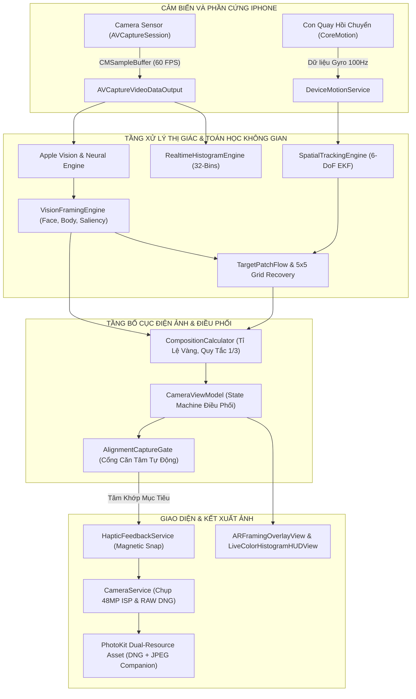

# AlignAI Studio - AI Smart Framing Camera

<div align="center">


[](https://github.com/emlavankhoahienma-hue/ai-smart-framing-camera/actions/workflows/ios-build.yml)
[](https://github.com/emlavankhoahienma-hue/ai-smart-framing-camera/releases/latest)
[](https://developer.apple.com/ios/)
[](https://swift.org)
[](https://apple.com)
[](https://ai.google.dev)
[](LICENSE)

<p align="center">
  <b>Hệ Thống Camera Nhiếp Ảnh Nghệ Thuật & Căn Tâm Tự Động Thông Minh Trên iOS</b><br>
  Định vị điểm vàng bố cục theo tỷ lệ điện ảnh, bám dính chủ thể bằng thuật toán lai quang học kết hợp con quay hồi chuyển 6-DoF EKF, cơ chế căn tâm chống rung tự động (Alignment Dwell Gate), chụp ảnh 48MP ISP gốc, bảo toàn tệp RAW DNG đa tài nguyên cùng JPEG xem trước chuẩn Display P3, và tái hiện 9 phong cách màu phim kinh điển.
</p>

[Tải File IPA](#huong-dan-cai-dat-sideload) • [Tính Năng Nổi Bật](#tinh-nang-noi-bat) • [Kiến Trúc & Thuật Toán](#kien-truc--thuat-toan-cot-loi) • [Bộ Quy Tắc Bố Cục](#bo-quy-tac-bo-cuc-dien-anh) • [Màu Phim Nghệ Thuật](#bo-suu-tap-9-mau-phim-nghe-thuat) • [Hướng Dẫn Sử Dụng](#huong-dan-su-dung) • [Yêu Cầu Hệ Thống](#yeu-cau-he-thong)

---

</div>

## Mục Lục
1. [Tổng Quan Dự Án](#tong-quan-du-an)
2. [Tính Năng Nổi Bật](#tinh-nang-noi-bat)
3. [Kiến Trúc & Thuật Toán Cốt Lõi](#kien-truc--thuat-toan-cot-loi)
   - 3.1. [Sơ Đồ Kiến Trúc Hệ Thống Toàn Diện](#31-so-do-kien-truc-he-thong-toan-dien)
   - 3.2. [Cổng Căn Tâm Tự Động (Alignment Dwell Gate)](#32-cong-can-tam-tu-dong-alignment-dwell-gate)
   - 3.3. [Hợp Nhất Đa Cảm Biến 6-DoF EKF & Lọc Rung Thích Ứng](#33-hop-nhat-da-cam-bien-6-dof-ekf--loc-rung-thich-ung)
   - 3.4. [Hệ Thống Phục Hồi Mục Tiêu Lưới 5x5 (Budgeted Search)](#34-he-thong-phuc-hoi-muc-tieu-luoi-5x5-budgeted-search)
   - 3.5. [Hình Học Xạ Ảnh 3D & Phép Chiếu Conformal AspectFill](#35-hinh-hoc-xa-anh-3d--phep-chieu-conformal-aspectfill)
4. [Bộ Quy Tắc Bố Cục Điện Ảnh](#bo-quy-tac-bo-cuc-dien-anh)
5. [Bộ Sưu Tập 9 Màu Phim Nghệ Thuật](#bo-suu-tap-9-mau-phim-nghe-thuat)
6. [Khoang Lái Pro HUD & Công Cụ Chuyên Nghiệp](#khoang-lai-pro-hud--cong-cu-chuyen-nghiep)
7. [Hướng Dẫn Sử Dụng & Bảng Cử Chỉ](#huong-dan-su-dung)
8. [Hướng Dẫn Cài Đặt Sideload](#huong-dan-cai-dat-sideload)
9. [Cấu Trúc Thư Mục Mã Nguồn](#cau-truc-thu-muc-ma-nguon)
10. [Yêu Cầu Hệ Thống & Hiệu Năng](#yeu-cau-he-thong)
11. [Thông Tin Tác Giả & Giấy Phép](#thong-tin-tac-gia--giay-phep)

---

## Tổng Quan Dự Án

**AlignAI Studio** là ứng dụng camera nhiếp ảnh nghệ thuật mã nguồn mở dành cho hệ điều hành iOS (hỗ trợ từ iOS 16.0 đến iOS 18+). Ứng dụng giải quyết bài toán: **Làm thế nào để người chụp không chuyên luôn bắt trọn những góc máy chuẩn tỷ lệ vàng như nhiếp ảnh gia kỳ cựu.**

Không dừng lại ở việc áp bộ lọc màu, **AlignAI Studio** kết hợp trực tiếp giữa phần cứng **Apple Neural Engine (ANE)**, cảm biến chuyển động **CoreMotion**, bộ xử lý tín hiệu hình ảnh **Apple ISP** và trí tuệ nhân tạo thị giác để tạo nên một hệ thống đồng bộ khép kín:

* **Thị giác máy tính tầng sâu (Neural Vision)**: Nhận diện khuôn mặt, tư thế cơ thể, hướng ánh mắt (*Looking Room / Lead Room*), đối tượng nổi bật (*Object Saliency*) và phân loại cảnh quan ngoại vật.
* **Định vị bố cục tỷ lệ vàng (Golden Ratio Engine)**: Tính toán chính xác vị trí đặt chủ thể tối ưu theo các chuẩn mực nghệ thuật cổ điển.
* **Căn tâm tự động chống rung tay (Alignment Dwell Gate)**: Hệ thống vòng ngắm kép (tâm ngắm trắng cố định và vòng vàng mục tiêu di động). Khi người dùng đưa tâm trắng khớp vào vòng vàng, cơ chế tích lũy bằng chứng quang học sẽ kích hoạt rung phản hồi xúc giác cơ học và tự động bấm màn trập không trễ.
* **Chụp ảnh 48MP ISP & RAW DNG Đa Tài Nguyên**: Khai thác cảm biến độ phân giải cao gốc của iPhone, lưu trữ đồng thời tệp RAW DNG nguyên bản và JPEG xem trước chuẩn Display P3 vào cùng một tài nguyên PhotoKit, triệt tiêu lỗi màn hình đen khi mở thư viện ảnh.

---

## Tính Năng Nổi Bật

| Nhóm Tính Năng | Mô Tả Chi Tiết |
| :--- | :--- |
| **Căn Tâm Tự Động Thông Minh** | Tích hợp cổng căn tâm `AlignmentCaptureGate` với ngưỡng thời gian tích lũy 240 ms và vùng trễ chống rung 140 ms. Triệt tiêu hiện tượng chụp nhầm khi lia máy nhanh hoặc rung tay sinh học. |
| **Bám Bắt Mục Tiêu 6-DoF EKF** | Hợp nhất luồng quang học Apple Vision 30 Hz và con quay hồi chuyển CoreMotion 100 Hz bằng bộ lọc Kalman mở rộng. Vòng mục tiêu bám chắc vào không gian thực tế ngay cả khi lia máy 400 độ. |
| **Chụp Ảnh Siêu Nét 48MP Gốc** | Kích hoạt `maxPhotoDimensions` trực tiếp trên pipeline camera Apple ISP. Không nội suy điểm ảnh nhân tạo, giữ trọn độ nét chi tiết của cảm biến 48MP trên các dòng iPhone Pro. |
| **Định Dạng RAW DNG Đích Thực** | Lưu byte RAW DNG nguyên bản từ cảm biến cho các ứng dụng đồ họa chuyên nghiệp (Lightroom, Photoshop), đồng thời nhúng bản JPEG xem trước chuẩn màu Display P3 vào cùng PhotoKit Asset. |
| **Cinematic Zoom Reveal** | Trước khi điều khiển thấu kính zoom phần cứng, màn hình hiển thị trước vùng crop trung tâm và làm mờ viền ngoài trong thời gian ngắn để người dùng định hình bố cục tổng thể. |
| **Phục Hồi Mục Tiêu Lưới 5x5** | Khi chủ thể rời khung hình hoặc bị che khuất, thuật toán quét tuần tự 25 vùng trên lưới 5x5, kết hợp so khớp màu Bhattacharyya và mạng nơ-ron FeaturePrint để tìm lại đối tượng mà không nghẽn FPS. |
| **Kho Màu Phim Studio** | Bộ xử lý màu `FilmFilterEngine` chuẩn Core Image với 9 công thức màu phim kinh điển (Fuji Pro 400H, Kodak Portra 400, Cinematic Teal & Orange, Leica Noir...). |
| **Khoang Lái Pro HUD** | Hiển thị biểu đồ phân tích màu sắc quang phổ thời gian thực Rec.709 32 băng tần, đo lường ISO phần cứng, tốc độ màn trập, cân bằng đường chân trời (Horizon Leveler) và Focus Peaking. |

---

## Kiến Trúc & Thuật Toán Cốt Lõi

### 3.1. Sơ Đồ Kiến Trúc Hệ Thống Toàn Diện



---

### 3.2. Cổng Căn Tâm Tự Động (Alignment Dwell Gate)

Cơ chế căn tâm giải quyết bài toán chống rung tay tự nhiên bằng bộ lọc trễ hai tầng:

```
                  Khoang Cach Giua Tam Trang Va Vong Vang
  [ NGOAI VUNG ]            [ VUNG GIU (1.35x) ]            [ VUNG KHOA (1.0x) ]
───────────────┼──────────────────────────────┼──────────────────────────────>
  Reset Bo Dem | Cho phep rung tay < 140ms    | Tich luy Dwell Time >= 240ms
  State: OUTSIDE| State: HOLDING              | State: READY -> TU DONG CHUP
```

* **Ngưỡng vào (`1.0x`)**: Khi khoảng cách giữa tâm ngắm trắng và vòng tròn vàng nhỏ hơn bán kính ngắm, trạng thái căn tâm bắt đầu tích lũy thời gian (`dwell += dt`).
* **Thời gian duy trì (`240 ms`)**: Bộ đếm tích lũy đủ 240 ms bằng chứng quang học hợp lệ liên tục sẽ kích hoạt màn trập.
* **Ngưỡng giữ chống rung (`1.35x - 1.8x`)**: Khi đã vào trạng thái căn tâm, vùng cho phép giữ được mở rộng ra 1.35 lần bán kính. Nếu tay rung lắc nhẹ làm tâm lệch ra ngoài trong thời gian dưới 140 ms, bộ đếm không bị reset mà chỉ tạm dừng, giúp quá trình chụp diễn ra tự nhiên và chính xác.

---

### 3.3. Hợp Nhất Đa Cảm Biến 6-DoF EKF & Lọc Rung Thích Ứng

Để triệt tiêu hiện tượng vòng mục tiêu bị rung giật khi tay đứng yên nhưng vẫn bám dính tức thì khi lia máy nhanh, hệ thống sử dụng thuật toán nội suy làm mượt Hermite Smoothstep trên phần dư không gian:

$$\text{motionFraction} = \text{clamp}\left(\frac{\text{residual} - 0.02}{0.08}, 0, 1\right)$$

$$\text{motionGain} = \text{motionFraction}^2 \cdot (3 - 2 \cdot \text{motionFraction}) \cdot K_{\text{evidence}}$$

* Khi máy đứng yên hoặc rung nhẹ ($\text{residual} < 0.02$): Hệ số lọc chuyển sang nhánh tần số cắt thấp (`ordinaryGain`), giữ vòng ngắm bất động tuyệt đối trên mục tiêu.
* Khi lia máy hoặc chủ thể bước đi ($\text{residual} > 0.10$): Độ lợi chuyển mượt mà sang `motionGain`, bám sát theo tọa độ quang học mà không tạo độ trễ.

---

### 3.4. Hệ Thống Phục Hồi Mục Tiêu Lưới 5x5 (Budgeted Search)

Khi mục tiêu bị che khuất hoặc ra khỏi khung hình lâu hơn 20 khung hình, hệ thống kích hoạt cơ chế quét lưới 5x5 với 25 ô tuần tự:

1. **Phân bổ ngân sách (Budgeted Scan)**: Mỗi khung hình chỉ kiểm tra tối đa 3 đề xuất vùng nghi vấn để không chiếm dụng hàng đợi hiển thị 60 FPS của camera.
2. **Bộ lọc màu Bhattacharyya (Tầng 1)**: Tính toán độ tương đồng giữa lược đồ màu gốc và vùng ứng viên:
   $$\text{Similarity} = \sum_{i=1}^{B} \sqrt{H_{\text{ref}}(i) \cdot H_{\text{cand}}(i)} \ge 0.62$$
   Loại bỏ 95% vùng không khớp chỉ trong 0.05 ms.
3. **Mạng Nơ-ron FeaturePrint (Tầng 2)**: 5% vùng vượt qua bài kiểm tra màu sắc sẽ được đưa vào mạng nơ-ron sâu để trích xuất vector đặc trưng và xác nhận danh tính mục tiêu.

---

### 3.5. Hình Học Xạ Ảnh 3D & Phép Chiếu Conformal AspectFill

* **Bắn tia camera lỗ kim (Pinhole Ray Casting)**:
  Biến đổi tọa độ điểm ảnh 2D $(u, v)$ thành tia định hướng 3D $\vec{R} \in \mathbb{R}^3$:
  $$\vec{R} = \text{normalize}\left(\begin{bmatrix} (u - c_x) / f_x \\ -(v - c_y) / f_y \\ -1 \end{bmatrix}\right)$$
* **Chiếu cầu khi mục tiêu ở sau lưng**:
  Khi $forward = -R_z \le 0$, phép chia phối cảnh thông thường sẽ làm đảo ngược tọa độ về tâm màn hình. Thuật toán chuyển sang hệ tọa độ góc cầu:
  $$dx = \text{atan2}(R_x, forward), \quad dy = -\text{atan2}(R_y, \sqrt{R_x^2 + forward^2})$$
  chiếu vector ra vô cực để vẽ con trỏ định hướng chính xác trên cạnh viền màn hình.
* **Giao cắt biên chữ nhật (Ray-Rectangle Edge Docking)**:
  Tự động ghim con trỏ mục tiêu vào 4 mép màn hình khi đối tượng trôi ra ngoài tầm nhìn (Off-screen), chừa khoảng đệm an toàn 30 pixel.

---

## Bộ Quy Tắc Bố Cục Điện Ảnh

| Quy Tắc Bố Cục | Thuật Toán Định Vị | Ứng Dụng Nghệ Thuật |
| :--- | :--- | :--- |
| **Quy Tắc 1/3 (Rule of Thirds)** | Đặt chủ thể vào 4 điểm giao điểm vàng của lưới $3 \times 3$, kết hợp bù trừ 12% khoảng trống nhìn (*Lead Room*) theo hướng ánh mắt. | Chân dung ngoại cảnh, đời thường, phong cảnh du lịch. |
| **Tỷ Lệ Vàng (Golden Ratio)** | Phân chia tọa độ theo hằng số $\Phi = 0.61803398875$, tạo điểm nhấn thị giác cân bằng hoàn hảo. | Ảnh nghệ thuật, thời trang, kiến trúc có chiều sâu. |
| **Xoắn Ốc Fibonacci (Golden Spiral)** | Dẫn dắt ánh mắt người xem lướt dọc theo đường cong hàm mũ từ tiền cảnh quy tụ về trung tâm chủ thể. | Đại cảnh thiên nhiên, đường phố rộng, nhiếp ảnh phong cách kể chuyện. |
| **Tâm Đối Xứng (Center Pro Symmetry)** | Khóa điểm ngắm tại tọa độ trung tâm tuyệt đối $(0.5, 0.5)$. | Kiến trúc mái vòm, cầu thang xoắn, ẩm thực cận cảnh, chân dung trực diện. |
| **Bố Cục Tam Giác Vàng (Golden Triangles)** | Chia khung hình theo đường chéo chính và hai đường vuông góc, tạo trục bố cục động lực học. | Chụp thể thao, chuyển động, đường dốc đô thị. |
| **AI Tự Động (Dynamic Smart Framing)** | Mạng nơ-ron phân loại bối cảnh thời gian thực để tự động đề xuất quy tắc phù hợp nhất. | Chụp nhanh hàng ngày, không cần thao tác chọn thủ công. |

---

## Bộ Sưu Tập 9 Màu Phim Nghệ Thuật

Toàn bộ công thức màu được tính toán thông qua đồ thị lọc màu Core Image trên không gian màu Display P3, giữ trọn độ mịn của chi tiết và màu da người tự nhiên:

```
[STD] Standard Clean  --> Mau sac trung thuc, dai tuong phan dong goc cua cam bien
[FUJI] Fuji Pro 400H  --> Tone xanh pastel diu mat, da trang hong, phong cach Nhat Ban
[PORTRA] Kodak Portra --> Sac vang am hoai niem, chuyen vung sang em diu, mau da kinh dien
[CINE] Teal & Orange  --> Tuong phan dien anh Hollywood: Bong xanh Teal, vung sang cam am
[SUNSET] Sunset Glow  --> Ton vinh sac vang cam hoang hon ruc ro va anh den do thi
[B&W] Noir Contrast   --> Den trang tuong phan cao, khoi den tuyen sau tham kieu anh bao chi
[70s] Vintage Warm    --> Retro thap nien 1970 voi dai bong do nang sang (Matte Lift)
[STREET] Street Mono  --> Mau duong pho gai goc, micro-contrast cao, tach bach cac lop khong gian
[AI*] AI Auto Color   --> Mau sac tu dong can bang nhiet do mau vi mo, hat phim va toi goc
```

---

## Khoang Lái Pro HUD & Công Cụ Chuyên Nghiệp

* **Biểu đồ Histogram Quang Phổ Rec.709 (32 Băng Tần)**:
  Phân tích độ sáng và sắc độ thời gian thực ở tốc độ 60 FPS với mức tiêu thụ CPU dưới 0.3%. Chia làm 3 dải màu trực quan: Vùng tối (Shadows), Vùng trung tính (Midtones/Da người), và Vùng sáng (Highlights/Bầu trời).
* **Hiển thị thông số phơi sáng phần cứng**:
  Cập nhật liên tục chỉ số ISO và tốc độ màn trập (Shutter Speed) thực tế từ cảm biến.
* **Cân bằng đường chân trời (Horizon Leveler)**:
  Con quay hồi chuyển hiển thị thước đo độ nghiêng chính xác tới 0.1 độ, chuyển sang màu vàng kim khi máy đạt độ phẳng cân đối hoàn hảo.
* **Đèn viền lấy nét (Focus Peaking)**:
  Tô sáng các cạnh chi tiết đạt độ nét quang học tối đa với màu sắc tùy chỉnh.

---

## Hướng Dẫn Sử Dụng

### Bảng Thao Tác Cử Chỉ Trực Quan

| Thao Tác | Hành Động Của Hệ Thống |
| :--- | :--- |
| **Chạm 1 chạm vào chủ thể** | Đặt mỏ neo tracking. Vòng tròn vàng xuất hiện bám sát đối tượng. |
| **Lia máy đưa tâm trắng vào vòng vàng** | Khi hai tâm khớp nhau, máy rung phản hồi xúc giác và **tự động chụp ngay tức thì**. |
| **Vuốt hai ngón tay (Pinch Zoom)** | Zoom thủ công mượt mà. Hệ thống hủy zoom AI 1 lần an toàn, đợi ống kính ổn định mức zoom mới và tiếp tục chế độ căn tâm. |
| **Chạm đúp vào màn hình** | Đổi nhanh giữa các ống kính vật lý (0.5x Siêu rộng, 1x Góc rộng, 2x / 3x / 5x Telephoto). |
| **Chạm giữ 0.5 giây** | Khóa nét và khóa phơi sáng cố định (AE/AF Lock). |
| **Bấm nút RAW / JPEG trên HUD** | Chuyển đổi nhanh định dạng lưu ảnh giữa Pro RAW DNG 48MP và JPEG xử lý sẵn. |

---

## Hướng Dẫn Cài Đặt Sideload

Ứng dụng được biên dịch và đóng gói sẵn dưới dạng tệp `AISmartFramingCamera.ipa`. Không yêu cầu Jailbreak máy.

### Tải Tệp Cài Đặt
* **Liên kết chính thức**: [GitHub Releases - Bản v1.0.0-build.297](https://github.com/emlavankhoahienma-hue/ai-smart-framing-camera/releases/latest)
* **Đường dẫn tải tốc độ cao (Tối ưu mạng Việt Nam qua Cloudflare CDN)**:
  `https://gh-proxy.com/https://github.com/emlavankhoahienma-hue/ai-smart-framing-camera/releases/download/v1.0.0-build.297/AISmartFramingCamera.ipa`

---

### Phương Pháp 1: Cài đặt qua Sideloadly (Khuyến nghị cho Windows & macOS)
1. Tải và cài đặt phần mềm [Sideloadly](https://sideloadly.io/) trên máy tính.
2. Cắm iPhone vào máy tính qua cáp USB và chọn **Tin cậy máy tính này**.
3. Kéo thả tệp `AISmartFramingCamera.ipa` vào cửa sổ Sideloadly.
4. Nhập tài khoản Apple ID của bạn và bấm nút **Start**.
5. Sau khi hoàn tất, trên iPhone truy cập:
   `Cài đặt` -> `Cài đặt chung` -> `Quản lý VPN & Thiết bị` -> Chọn Apple ID của bạn -> Bấm **Tin cậy ứng dụng**.

---

### Phương Pháp 2: Cài đặt qua TrollStore (Dành cho thiết bị hỗ trợ)
1. Tải tệp `AISmartFramingCamera.ipa` trực tiếp bằng Safari trên iPhone.
2. Mở tệp bằng ứng dụng **TrollStore** và bấm **Install**.
3. Ứng dụng được cài đặt vĩnh viễn và không bao giờ bị thu hồi chứng chỉ (No Revoke).

---

### Phương Pháp 3: Cài đặt qua AltStore / SideStore
1. Mở **AltStore** trên iPhone, chuyển sang tab `My Apps`.
2. Bấm vào dấu `+` ở góc trên bên trái, chọn tệp `AISmartFramingCamera.ipa` đã tải về trong ứng dụng Tệp (Files).
3. Đợi AltStore ký chứng chỉ và hoàn tất cài đặt.

---

## Cấu Trúc Thư Mục Mã Nguồn

```
AISmartFramingCamera/
├── App/
│   └── AISmartFramingCameraApp.swift          # Điểm khởi nhập chính của ứng dụng SwiftUI
├── Models/
│   └── FramingModels.swift                    # Mô hình dữ liệu, chuẩn lưu ảnh, Enums, AI Params
├── Services/
│   ├── CameraService.swift                    # Điều khiển phần cứng AVCaptureSession 60 FPS & ISP 48MP
│   ├── VisionFramingEngine.swift              # Nhận diện khuôn mặt, cơ thể người, phục hồi lưới 5x5
│   ├── SpatialTrackingEngine.swift            # Thuật toán lai quang học - quán tính 6-DoF EKF Fusion
│   ├── TrackingGeometry.swift                 # Hình học xạ ảnh 3D, bắn tia lỗ kim, cắt biên chữ nhật
│   ├── TargetPatchFlow.swift                  # Theo dõi luồng quang học ma trận cục bộ
│   ├── CompositionCalculator.swift            # Tính toán tọa độ điểm vàng theo 5 quy tắc bố cục
│   ├── FilmFilterEngine.swift                 # Đồ thị lọc màu phim Core Image chuẩn Studio Display P3
│   ├── RealtimeHistogramEngine.swift          # Bộ phân tích biểu đồ quang phổ 32 băng tần Rec.709
│   ├── FocusPeakingEngine.swift               # Động cơ quét viền nét quang học thời gian thực
│   ├── DeviceMotionService.swift              # Quản lý cảm biến con quay hồi chuyển CoreMotion
│   ├── HapticFeedbackService.swift            # Điều khiển phản hồi xúc giác cơ học Magnetic Snap
│   └── GeminiService.swift                    # Tích hợp Google Gemini 2.5 Flash / Pro tự động luân chuyển
├── ViewModels/
│   └── CameraViewModel.swift                  # Trục điều phối trung tâm MVVM, tích hợp AlignmentGate
└── Views/
    ├── CameraMainView.swift                   # Màn hình camera chính và các lớp giao diện
    ├── CameraPreviewView.swift                # Khung nhìn hiển thị lớp đệm camera phần cứng
    ├── ARFramingOverlayView.swift             # Vẽ tâm ngắm trắng, vòng tròn vàng, Zoom Reveal Overlay
    ├── LiveColorHistogramHUDView.swift        # Thanh HUD Pro hiển thị Histogram, ISO, Shutter
    ├── CameraControlsView.swift               # Bảng nút chụp, chỉnh zoom, thanh trượt phơi sáng
    ├── CapturedPhotoPreviewView.swift         # Xem lại ảnh chụp, lưu DNG + JPEG đa tài nguyên PhotoKit
    ├── SettingsSheetView.swift                # Cài đặt Gemini API, thư viện mẫu màu phim và cấu hình
    └── FeedbackView.swift                     # Giao diện đóng góp ý kiến từ người dùng
```

---

## Yêu Cầu Hệ Thống

| Tiêu Chí | Yêu Cầu Tối Thiểu | Yêu Cầu Khuyến Nghị |
| :--- | :--- | :--- |
| **Hệ Điều Hành** | iOS 16.0 trở lên | iOS 17.0 hoặc iOS 18.0+ |
| **Vi Xử Lý** | Apple A11 Bionic (iPhone 8 / X) | Apple A16 Bionic đến A18 Pro (iPhone 14 Pro - 16 Pro Max) |
| **Khả Năng Chụp 48MP** | Camera 12MP (ảnh tối đa 12MP) | Cảm biến 48MP Quad-Bayer (iPhone 14 Pro trở lên) |
| **Hỗ Trợ RAW DNG** | Thiết bị hỗ trợ Apple ProRAW hoặc Bayer RAW | iPhone dòng Pro / Pro Max |
| **Bộ Nhớ RAM** | Tối thiểu 3 GB RAM | 6 GB - 8 GB RAM |

---

## Thông Tin Tác Giả & Giấy Phép

* **Kỹ sư phát triển**: **VanKhoa**
* **Kho lưu trữ chính thức**: [GitHub Repository](https://github.com/emlavankhoahienma-hue/ai-smart-framing-camera)
* **Giấy phép phát hành**: Dự án được phân phối dưới giấy phép mã nguồn mở **MIT License**. Mọi cá nhân và tổ chức đều có quyền tự do sử dụng, chỉnh sửa và đóng góp theo các điều khoản của giấy phép.

<div align="center">

*Phát hành chính thức năm 2026. Thiết kế vì tình yêu nghệ thuật nhiếp ảnh điện ảnh.*

</div>
