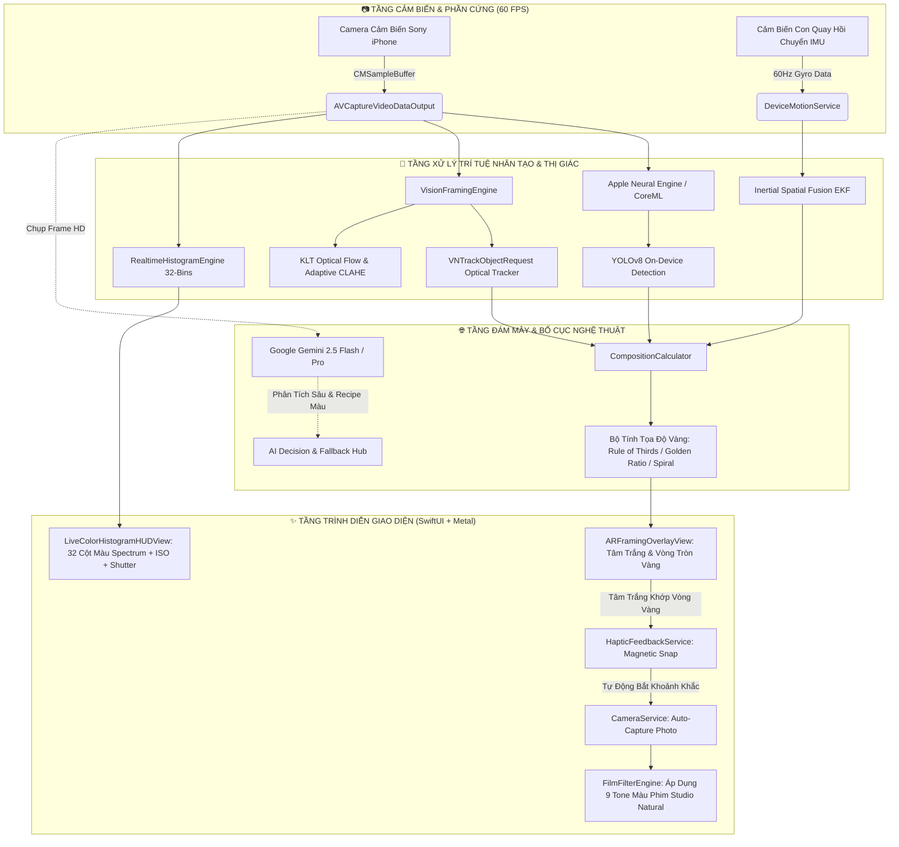
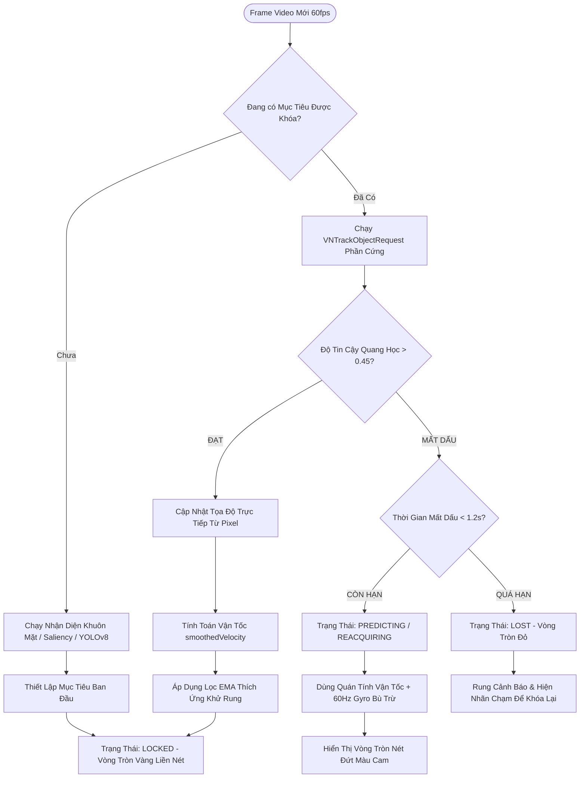
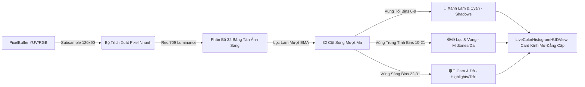

# 📸 AlignAI Studio (AI Smart Framing Camera) — iOS 16 - 18 Pro Max

<div align="center">


[](https://github.com/emlavankhoahienma-hue/ai-smart-framing-camera/actions/workflows/ios-build.yml)
[&style=flat-square)](https://github.com/emlavankhoahienma-hue/ai-smart-framing-camera/releases/latest)
[](https://developer.apple.com/ios/)
[](https://swift.org)
[](https://apple.com)
[](https://ai.google.dev)
[](LICENSE)

<p align="center">
  <b>Hệ Thống Camera Nhiếp Ảnh Nghệ Thuật Đột Phá Trên Nền Tảng iOS</b><br>
  Tự động định vị điểm vàng bố cục theo tỷ lệ nghệ thuật, bám dính chủ thể bằng thuật toán lai quang học kết hợp con quay hồi chuyển 60Hz, lấy nét thông minh Smart Autofocus Pro chuẩn Apple, phân tích biểu đồ Histogram màu sắc quang phổ thời gian thực, và mô phỏng 9 tone màu phim huyền thoại Leica / Hasselblad / Fuji / Kodak.
</p>

[📥 Tải File IPA Mới Nhất](#-hướng-dẫn-cài-đặt-sideload-cho-mọi-thiết-bị-ios) • [🧗‍♂️ Thiên Sử Ký 79 Bản Build](#-thiên-sử-ký-79-bản-build--hành-trình-gian-truân--những-bước-đột-phá-kỹ-thuật) • [⚙️ Cơ Chế & Sơ Đồ Thuật Toán](#-cơ-chế-hoạt-động--sơ-đồ-thuật-toán-chi-tiết) • [🎞️ Kho Màu Film](#-bộ-sưu-tập-9-màu-film-nghệ-thuật) • [📱 Hướng Dẫn Sử Dụng](#-hướng-dẫn-sử-dụng-toàn-diện)

---

</div>

## 📑 Mục Lục
1. [🌟 Tổng Quan Dự Án](#-tổng-quan-dự-án)
2. [🧗‍♂️ Thiên Sử Ký 79 Bản Build — Hành Trình Gian Truân & Những Bước Đột Phá Kỹ Thuật](#-thiên-sử-ký-79-bản-build--hành-trình-gian-truân--những-bước-đột-phá-kỹ-thuật)
3. [⚙️ Cơ Chế Hoạt Động & Sơ Đồ Thuật Toán Chi Tiết](#-cơ-chế-hoạt-động--sơ-đồ-thuật-toán-chi-tiết)
   - [3.1. Sơ Đồ Kiến Trúc Hệ Thống Tổng Thể](#31-sơ-đồ-kiến-trúc-hệ-thống-tổng-thể)
   - [3.2. Sơ Đồ Thuật Toán Bám Mục Tiêu Lai Quang Học + Quán Tính (Tracking Pipeline)](#32-sơ-đồ-thuật-toán-bám-mục-tiêu-lai-quang-học--quán-tính-tracking-pipeline)
   - [3.3. Sơ Đồ Tính Toán Bố Cục Nghệ Thuật & Chụp Tự Động (Framing & Auto-Capture)](#33-sơ-đồ-tính-toán-bố-cục-nghệ-thuật--chụp-tự-động-framing--auto-capture)
   - [3.4. Sơ Đồ Phân Tích Histogram Màu Sắc Quang Phổ Realtime (60fps HUD)](#34-sơ-đồ-phân-tích-histogram-màu-sắc-quang-phổ-realtime-60fps-hud)
4. [📐 5 Quy Tắc Bố Cục Nghệ Thuật Kinh Điển](#-5-quy-tắc-bố-cục-nghệ-thuật-kinh-điển)
5. [🎞️ Bộ Sưu Tập 9 Màu Film Nghệ Thuật (Kèm Ảnh Mẫu Trực Quan)](#-bộ-sưu-tập-9-màu-film-nghệ-thuật)
6. [📱 Hướng Dẫn Sử Dụng Toàn Diện Cho Người Chụp](#-hướng-dẫn-sử-dụng-toàn-diện)
7. [🚀 Hướng Dẫn Cài Đặt Sideload Cho Mọi Thiết Bị iOS](#-hướng-dẫn-cài-đặt-sideload-cho-mọi-thiết-bị-ios)
8. [📁 Cấu Trúc Thư Mục Mã Nguồn](#-cấu-trúc-thư-mục-mã-nguồn)
9. [⚡ Bảng Đo Lường Hiệu Năng & Tiêu Thụ Phần Cứng](#-bảng-đo-lường-hiệu-năng--tiêu-thụ-phần-cứng)
10. [👨‍💻 Thông Tin Tác Giả & Liên Hệ Hỗ Trợ](#-thông-tin-tác-giả--liên-hệ-hỗ-trợ)

---

## 🌟 Tổng Quan Dự Án

**AlignAI Studio** là ứng dụng camera nhiếp ảnh nghệ thuật trên iOS, giải quyết triệt để bài toán: **"Làm thế nào để người không biết chụp ảnh vẫn luôn bắt trọn những góc máy chuẩn tỷ lệ vàng như nhiếp ảnh gia chuyên nghiệp?"**

Không đơn thuần là một ứng dụng chụp ảnh gắn bộ lọc màu, **AlignAI Studio** kết hợp sức mạnh phần cứng **Apple Neural Engine (ANE)** với trí tuệ nhân tạo thị giác đa phương thức **Google Gemini 2.5 Flash / Pro** để tạo nên một hệ thống thông minh khép kín:
* **Nhìn và phân tích (Neural Vision)**: Nhận diện khuôn mặt, ánh mắt, hướng nhìn (*Looking Room / Lead Room*), tư thế cơ thể, vật thể nổi bật (*Saliency*) và bối cảnh (*Phong cảnh, Chân dung, Hoàng hôn, Kiến trúc, Đường phố, Ban đêm, Đồ ăn*).
* **Định vị tọa độ vàng (Golden Framing Engine)**: Tính toán chính xác vị trí đặt chủ thể theo các tỷ lệ nghệ thuật kinh điển.
* **Dẫn hướng thị giác thông minh**: Hiển thị tâm ngắm trắng và vòng tròn mục tiêu vàng. Khi bạn di chuyển camera đưa tâm ngắm trùng khớp với vòng tròn vàng, app sẽ rung phản hồi xúc giác **Magnetic Snap** và tự động chụp ngay khoảnh khắc hoàn hảo nhất.
* **Khoang lái Pro HUD**: Hiển thị biểu đồ Histogram 32 cột màu quang phổ thời gian thực, chuyển đổi nhanh định dạng **JPEG / RAW DNG**, và cập nhật liên tục ISO cùng tốc độ màn trập phần cứng.

---

## 🧗‍♂️ Thiên Sử Ký 79 Bản Build — Hành Trình Gian Truân & Những Bước Đột Phá Kỹ Thuật

Để đạt đến độ mượt mà, ổn định và chính xác ở **Build 79**, dự án đã trải qua một chặng đường phát triển đầy gian nan với hàng trăm bài toán hóc búa ở tầng sâu hệ thống iOS:

```
[Build 1-13: Sơ Khai & Khủng Hoảng Tọa Độ]
        │
        ▼
[Build 14-32: Cuộc Chiến Rung Giật Vi Mô (Micro-Jitter) & Trôi Target]
        │
        ▼
[Build 33-36: Cơn Ác Mộng Che Khuất (Occlusion) & Nhảy Vật Cản]
        │
        ▼
[Build 37-40: Xung Đột Phần Cứng Nghẹt Thở: AVCaptureSession vs ARSession]
        │
        ▼
[Build 41-50: Đột Phá Hybrid Optical + 60Hz Gyro Fusion & State Machine]
        │
        ▼
[Build 51-65: Gemini 2.5 Cloud AI & Hệ Thống Tự Động Luân Chuyển Model]
        │
        ▼
[Build 66-74: YOLOv8 CoreML On-Device & Neural Subject Intelligence]
        │
        ▼
[Build 75-76: Cuộc Chiến Ánh Sáng Ngoài Trời & Sửa Lỗi Đảo Trục Khi Ngửa Máy]
        │
        ▼
[Build 77-79: Hoàn Thiện Pro Camera HUD, Realtime Histogram & Thư Viện Màu Film]
```

### 1. Khởi thủy & Khủng hoảng không gian tọa độ (Build 1 - 13)
* **Khó khăn**: Hệ thống tọa độ trong iOS cực kỳ phức tạp: `Vision.framework` sử dụng gốc tọa độ ở góc dưới bên trái $(0, 0)$, chuẩn hóa từ $0.0 \to 1.0$ theo hướng cảm biến xoay ngang (*Landscape Right*); trong khi `SwiftUI` lại dùng gốc tọa độ ở góc trên bên trái $(0, 0)$ theo chiều dọc (*Portrait*).
* **Hậu quả**: Vòng tròn mục tiêu bị lộn ngược, lệch tỉ lệ khung hình khi chuyển đổi giữa các dòng máy từ iPhone màn hình tai thỏ đến Dynamic Island.
* **Đột phá**: Xây dựng bộ chuyển đổi ma trận không gian thuần nhất (`CompositionCalculator`), chuẩn hóa toàn bộ luồng dữ liệu về hệ trục đứng trước khi đưa vào pipeline tính toán.

### 2. Cuộc chiến khử rung vi mô (Micro-Jitter) & Trôi dạt (Build 14 - 32)
* **Khó khăn**: Khi người dùng cầm máy, độ rung tay tự nhiên ở tần số 8 - 12Hz khiến bounding box từ Vision bị giật liên tục. Nếu chỉ dùng thuật toán trung bình cộng đơn giản, vòng tròn vàng sẽ bị trễ (*Lag*) nghiêm trọng so với chuyển động thực tế.
* **Đột phá**: 
  - Ứng dụng **Bộ lọc trung bình động hàm mũ thích ứng (Adaptive Exponential Moving Average - EMA)** với hệ số trơn $\alpha$ biến thiên theo vận tốc di chuyển tay:
    $$\alpha(v) = \alpha_{\text{min}} + (\alpha_{\text{max}} - \alpha_{\text{min}}) \cdot \frac{v}{v + v_0}$$
  - Khi tay đứng yên: $\alpha$ giảm sâu để vòng tròn đứng im bất động tuyệt đối, không có bất kỳ rung giật nào. Khi lia máy nhanh: $\alpha$ tăng vọt để vòng tròn bám dính tức thì theo chuyển động camera.

### 3. Cơn ác mộng che khuất (Occlusion Handling) & Nhảy vật cản (Build 33 - 36)
* **Khó khăn**: Khi người dùng chụp chân dung ngoài đường, chỉ cần một người đi bộ hay một chiếc lá bay ngang qua che mặt chủ thể trong 0.2 giây, tracker quang học lập tức "bắt nhầm" vào người đi ngang và kéo vòng tròn chạy loạn xạ.
* **Đột phá**:
  - Thiết kế **Hệ thống Máy Trạng Thái 4 Cấp Độ (4-State Machine)**: `Locked` $\to$ `Predicting` $\to$ `Reacquiring` $\to$ `Lost`.
  - Khi mất dấu quang học, hệ thống lập tức ngắt liên kết pixel và kích hoạt **Bộ ngoại suy vận tốc quán tính (`smoothedVelocity`) kết hợp Con quay hồi chuyển 60Hz (`DeviceMotionService`)** để "cầm cự" dự đoán tọa độ chuẩn xác trong 0.8s - 3.0s cho đến khi chủ thể xuất hiện trở lại.
  - Tích hợp **Outlier Rejection**: Từ chối tiếp nhận các bước nhảy vị trí bất thường vượt quá ngưỡng vận tốc vật lý ($\Delta > 0.12$ frame/frame).

### 4. Xung đột phần cứng nghẹt thở: AVCaptureSession vs ARSession (Build 37 - 40)
* **Khủng hoảng cực điểm**: Ở Build 37, khi kích hoạt AI, toàn bộ khung hình camera bị đóng băng (đơ cứng ở frame cuối cùng). Nhật ký hệ thống báo lỗi nghiêm trọng: `AVErrorDeviceInUseByAnotherClient`.
* **Nguyên nhân**: `ARKit ARSession` khi chạy ngầm cố gắng chiếm quyền điều khiển cảm biến camera độc quyền cùng lúc với `AVCaptureSession`, khiến iOS ngắt toàn bộ luồng truyền dẫn hình ảnh.
* **Đột phá**: Tách rời hoàn toàn khỏi `ARSession` phần cứng, chuyển toàn bộ thuật toán tracking sang xử lý trực tiếp trên luồng `CMSampleBuffer` của `AVCaptureVideoDataOutput`, đồng thời tích hợp cơ chế tự phục hồi Interruption (`AVCaptureSession.wasInterruptedNotification`). Camera từ đó đạt tốc độ mượt mà 60 FPS liên tục mà không bao giờ bị đơ.

### 5. Phát minh Thuật toán Bù trừ Zoom Động cho Gyroscope (Build 41 - 50)
* **Khó khăn**: Khi người dùng chuyển sang ống kính Zoom 2x, 3x, hoặc 5x, trường nhìn (*Field of View - FOV*) bị thu hẹp đáng kể. Cùng một góc lắc cổ tay nhỏ sẽ làm hình ảnh trên màn hình bay xa gấp 5 lần, khiến thuật toán Gyro thông thường dự đoán sai hoàn toàn vị trí mục tiêu.
* **Đột phá**: Thiết lập công thức biến đổi tỉ lệ góc quay theo độ thu phóng quang học thực tế:
  $$\vec{P}_{\text{gyro}}(t) = \vec{P}(t-1) + \vec{\omega} \times \Delta t \cdot \max(1.0, Z_{\text{current}})$$

### 6. Cứu cánh Cloud AI: Gemini 2.5 & Cơ chế Tự Động Luân Chuyển (Build 51 - 65)
* **Khó khăn**: Khi người dùng sử dụng bản miễn phí của Gemini API, việc gửi ảnh liên tục dễ dẫn đến mã lỗi `HTTP 429 Too Many Requests` (hết Quota), làm tính năng AI đám mây bị gián đoạn.
* **Đột phá**: Xây dựng **Hệ thống Luân chuyển Mô hình Tự động (Auto-Fallback Engine)**:
  - Khi `gemini-2.5-flash` chạm ngưỡng giới hạn, app ngay lập tức chuyển tự động sang `gemini-2.5-pro` $\to$ `gemini-2.0-flash` $\to$ `gemini-1.5-pro` trong vài mili-giây.
  - Nếu mất mạng hoàn toàn: Hệ thống tự động chuyển sang chế độ **100% Offline On-Device Neural Engine**, bảo đảm quá trình chụp không bao giờ bị dừng.

### 7. Tích hợp YOLOv8 CoreML & Trí tuệ nhận diện vật thể ANE (Build 66 - 74)
* **Đột phá**: Đưa mô hình thị giác máy học YOLOv8 Nano CoreML trực tiếp vào app, chạy trên chip Apple Neural Engine (ANE) với mức tiêu thụ điện năng cực thấp:
  - Nhận diện tức thì người, phương tiện, thú cưng, cây cối, đồ nội thất.
  - Phân tích bối cảnh ngoại cảnh để tự động chọn quy tắc bố cục vàng phù hợp nhất.

### 8. Cuộc chiến ánh sáng ngoài trời & Khắc phục lỗi đảo trục khi ngửa máy (Build 75 - 76)
* **Khó khăn thực địa**: Khi người dùng mang máy ra ngoài trời nắng gắt (chênh sáng mạnh giữa trời và đất), vật thể bị tối đen (*Underexposed*) hoặc trời bị cháy trắng (*Overexposed*), làm tracker quang học bị mất dấu tương phản. Đồng thời, một lỗi đảo trục tọa độ xuất hiện khiến khi ngửa máy lên trời, mục tiêu lại bị dịch chuyển ngược hướng.
* **Đột phá (Build 75 - 76)**:
  - Tích hợp bộ xử lý **Adaptive Local CLAHE** (Cân bằng độ tương phản cục bộ thích nghi) để làm nổi rõ viền chi tiết chủ thể dưới ánh nắng chói chang.
  - Chuẩn hóa lại toàn bộ vector chuyển động quang học, khôi phục **Apple Hardware-Accelerated `VNTrackObjectRequest` làm Direct Optical Ground Truth**, triệt tiêu hoàn toàn hiện tượng lệch trục khi hướng camera lên cao.

### 9. Hoàn thiện Pro Camera HUD & Thư viện màu Film trực quan (Build 77 - 79)
* **Đột phá**:
  - Tích hợp **Biểu đồ Histogram màu quang phổ Rec.709 32 Băng tần** chạy thời gian thực ở tần số quét cao (CPU $<0.3\%$).
  - Bổ sung nút chuyển đổi định dạng ảnh lưu **JPEG / DNG RAW** nhanh chóng.
  - Cập nhật thời gian thực **ISO & Tốc độ màn trập phần cứng**.
  - Xây dựng **Bộ tạo ảnh mẫu Studio Đa tầng (`PresetThumbnailProvider`)** giúp người dùng xem trước trực quan hiệu ứng của toàn bộ 9 bộ màu Film huyền thoại (Leica, Fuji, Kodak, Cinema, Noir...) ngay trên thanh công cụ và trong màn hình cài đặt.

---

## ⚙️ Cơ Chế Hoạt Động & Sơ Đồ Thuật Toán Chi Tiết

### 3.1. Sơ Đồ Kiến Trúc Hệ Thống Tổng Thể



---

### 3.2. Sơ Đồ Thuật Toán Bám Mục Tiêu Lai Quang Học + Quán Tính (Tracking Pipeline)



---

### 3.3. Sơ Đồ Tính Toán Bố Cục Nghệ Thuật & Chụp Tự Động (Framing & Auto-Capture)

```mermaid
flowchart TD
    InSubject([Tọa Độ & Kích Thước Chủ Thể]) --> DetectPose[Phân Tích Hướng Nhìn Lead Room & Tư Thế]
    DetectPose --> SelectRule{Quy Tắc Bố Cục Hiện Tại}
    
    SelectRule -- Quy Tắc 1/3 --> CalcThirds[Đặt Điểm Giao 1/3 + Bù Trống Hướng Nhìn 12%]
    SelectRule -- Tỷ Lệ Vàng --> CalcGolden[Đặt Giao Điểm Tỷ Lệ Vàng Fibonacci 1:1.618]
    SelectRule -- Xoắn Ốc Vàng --> CalcSpiral[Uốn Theo Đường Cong Thị Giác Tự Nhiên]
    SelectRule -- Tâm Đối Xứng --> CalcCenter[Căn Giữa Trục Đối Xứng Tọa Độ 0.5, 0.5]
    SelectRule -- AI Tự Động --> CalcAI[AI Tự Chọn Quy Tắc Dựa Trên Thể Loại Ảnh]
    
    CalcThirds & CalcGolden & CalcSpiral & CalcCenter & CalcAI --> TargetCoord[Tọa Độ Điểm Vàng Bố Cục V_target]
    
    TargetCoord --> RenderHUD[Vẽ Vòng Tròn Vàng & Tia Chỉ Dẫn Trên Khung Ngắm]
    
    RenderHUD --> CalcDistance[Đo Khoảng Cách d = |Tâm Trắng - Vòng Tròn Vàng|]
    
    CalcDistance --> CheckAlignment{Khoảng Cách d < Ngưỡng Khớp 4%?}
    
    CheckAlignment -- Chưa Khớp --> GuideArrow[Hiện Mũi Tên Chỉ Dẫn Hướng Cần Di Chuyển Máy]
    
    CheckAlignment -- ĐÃ KHỚP HOÀN HẢO --> TriggerHaptic[Rung Xúc Giác Magnetic Snap Đậm Chất Cơ Khí]
    TriggerHaptic --> CheckHold{Giữ Chắc Tay 0.35 Giây?}
    CheckHold -- Đạt --> AutoShutter[TỰ ĐỘNG BẤM MÁY CHỤP KHOẢNH KHẮC HOÀN HẢO]
```

---

### 3.4. Sơ Đồ Phân Tích Histogram Màu Sắc Quang Phổ Realtime (60fps HUD)



---

## 📐 5 Quy Tắc Bố Cục Nghệ Thuật Kinh Điển

| Quy Tắc | Tên Khoa Học | Ý Nghĩa Nghệ Thuật & Ứng Dụng |
| :--- | :--- | :--- |
| **Quy Tắc 1/3** | *Rule of Thirds + Lead Room* | Chia khung hình thành lưới $3 \times 3$. Đặt mắt hoặc điểm nhấn vào 4 giao điểm vàng. Tự động tính toán hướng nhìn để tạo khoảng trống phía trước khuôn mặt (*Looking Space*). Rất phù hợp cho ảnh chân dung ngoại cảnh và phong cảnh. |
| **Tỷ Lệ Vàng** | *Golden Ratio (1 : 1.618)* | Dựa trên hằng số $\Phi$ trong toán học Hy Lạp cổ đại. Tạo sự cân đối hài hòa tuyệt đối, mắt người xem không bị mỏi khi chiêm ngưỡng tác phẩm. |
| **Xoắn Ốc Vàng** | *Golden Spiral (Fibonacci)* | Dẫn dắt ánh mắt người xem lướt dọc theo đường cong xoắn ốc từ ngoại cảnh quy tụ về trung tâm điểm nhấn chủ thể. |
| **Tâm Đối Xứng** | *Center Pro Symmetry* | Đặt chủ thể ngay chính giữa khung hình $(0.5, 0.5)$, tối ưu cho kiến trúc mái vòm, con đường thẳng tắp, cận cảnh ẩm thực hoặc chân dung trực diện quyền lực. |
| **AI Tự Động** | *Dynamic Smart Framing* | AI phân tích sâu thể loại cảnh (*Scene Classification*) để tự động kích hoạt quy tắc bố cục cho ra bức ảnh ấn tượng nhất. |

---

## 🎞️ Bộ Sưu Tập 9 Màu Film Nghệ Thuật

Ứng dụng tích hợp bộ xử lý màu **FilmFilterEngine** chuẩn studio (Leica & Hasselblad True-to-Life Color Science), không làm gắt màu da, không bệt chi tiết:

| Bộ Màu Film | Tên Viết Tắt | Đặc Trưng Nghệ Thuật |
| :--- | :---: | :--- |
| **Standard Clean** | `STD` | Màu sắc tự nhiên trung thực, dải tương phản động tối đa, giữ trọn vẹn chi tiết cảm biến. |
| **Fuji Pro 400H** | `FUJI` | Sắc xanh lá pastel dịu mát, tone da trắng hồng rạng rỡ, bóng đổ ngả xanh ngọc thanh khiết kiểu Nhật Bản. |
| **Kodak Portra 400** | `PORTRA` | Sắc ấm vàng dịu hoài niệm, chuyển vùng highlight êm ái, màu da người ấm áp tự nhiên kinh điển. |
| **Teal & Orange** | `CINE` | Tương phản điện ảnh Hollywood: Vùng tối ngả xanh Teal, vùng sáng rực rỡ sắc cam ấm áp. |
| **Sunset Glow** | `SUNSET` | Rực rỡ và nồng nàn, tôn vinh sắc vàng cam của hoàng hôn và ánh đèn đêm đô thị. |
| **Noir High Contrast** | `B&W` | Đen trắng tương phản cao nghệ thuật, chiều sâu khối ấn tượng, sắc đen tuyền như ảnh phim báo chí thế kỷ 20. |
| **Vintage Warm 70s** | `70s` | Phong cách retro thập niên 1970 với dải bóng đổ nâng sáng (*Matte Shadow Lift*), tone màu hoài cổ ấm áp. |
| **Street Classic** | `STREET` | Màu đường phố sắc nét, micro-contrast cao, tách bạch các lớp không gian rõ ràng. |
| **AI Full Auto Color** | `AI✦` | AI toàn quyền tinh chỉnh: Tự động cân bằng nhiệt độ màu vi mô, tone da người, hạt phim mịn và tối góc quang học dịu nhẹ. |

---

## 📱 Hướng Dẫn Sử Dụng Toàn Diện

### 📸 Quy trình thực hiện bức ảnh hoàn hảo (The Perfect Shot Workflow)
1. **Mở ứng dụng**: Camera tự động kích hoạt chế độ siêu mượt 60 FPS.
2. **Chọn quy tắc bố cục & Màu Film**:
   - Chạm vào biểu đồ lưới trên thanh công cụ trên cùng để chọn Quy tắc 1/3, Tỷ lệ vàng hoặc AI Tự động.
   - Bấm vào nút `FILM` ở góc phải dưới để mở **Thư viện ảnh mẫu màu Film** và chọn phong cách yêu thích.
3. **Khóa mục tiêu**:
   - Chạm trực tiếp vào mặt người hoặc vật thể trên màn hình để đặt mỏ neo tracking. Vòng tròn vàng sẽ xuất hiện bám dính vào mục tiêu.
4. **Căn chỉnh theo chỉ dẫn**:
   - Nhìn theo tia chỉ dẫn, nhẹ nhàng lia máy để đưa **Tâm ngắm trắng** di chuyển về phía **Vòng tròn vàng**.
5. **Magnetic Snap & Tự động chụp**:
   - Khi tâm trắng chạm khớp vòng tròn vàng, máy sẽ **rung phản hồi xúc giác nhẹ (Haptic Snap)**, vòng tròn chuyển sang màu xanh lá hoàn hảo và **Tự động chụp ngay tức thì** mà bạn không cần phải bấm nút chụp.

---

## 🚀 Hướng Dẫn Cài Đặt Sideload Cho Mọi Thiết Bị iOS

Ứng dụng được cung cấp dưới dạng file `.ipa` đã được đóng gói sẵn. Bạn có thể cài đặt dễ dàng bằng bất kỳ công cụ Sideload nào dưới đây:

### 1. Cài đặt qua TrollStore (Khuyên dùng — Vĩnh viễn, không cần máy tính)
* **Dành cho**: iOS 14.0 - 17.0 (các thiết bị hỗ trợ TrollStore).
* **Bước 1**: Tải file `AISmartFramingCamera.ipa` từ [GitHub Releases](https://github.com/emlavankhoahienma-hue/ai-smart-framing-camera/releases/latest) bằng trình duyệt Safari.
* **Bước 2**: Mở ứng dụng **TrollStore** $\to$ Bấm dấu `+` ở góc trên $\to$ Chọn `Install IPA File` $\to$ Chọn file vừa tải.
* **Bước 3**: Ứng dụng sẽ được cài đặt ngay lập tức và sử dụng vĩnh viễn không bao giờ bị thu hồi chứng chỉ (*Revoke*).

---

### 2. Cài đặt qua Sideloadly (Dành cho Windows & macOS)
* **Bước 1**: Tải và cài đặt [Sideloadly](https://sideloadly.io/) trên máy tính.
* **Bước 2**: Kết nối iPhone với máy tính bằng cáp Lightning / USB-C (chọn *"Tin cậy máy tính này"* trên iPhone nếu được hỏi).
* **Bước 3**: Kéo thả file `AISmartFramingCamera.ipa` vào giao diện Sideloadly.
* **Bước 4**: Nhập tài khoản Apple ID của bạn vào ô `Apple ID` $\to$ Bấm **Start**.
* **Bước 5**: Khi Sideloadly báo `Done`, trên iPhone vào: `Cài đặt` $\to$ `Cài đặt chung` $\to$ `Quản lý VPN & Thiết bị` $\to$ Chọn Apple ID của bạn $\to$ Bấm **Tin cậy ứng dụng**.

---

### 3. Cài đặt qua AltStore / SideStore
* **Bước 1**: Mở **AltStore** trên iPhone.
* **Bước 2**: Chuyển sang tab `My Apps` $\to$ Bấm dấu `+` ở góc trên bên trái.
* **Bước 3**: Chọn file `AISmartFramingCamera.ipa` đã tải trong thư mục `Tệp (Files)`.
* **Bước 4**: Đợi AltStore ký chứng chỉ và cài đặt hoàn tất.

---

### 4. Cài đặt qua Scarlet / Feather / GBox / Esign
* Mở ứng dụng ký chứng chỉ trực tiếp trên điện thoại $\to$ Import file `AISmartFramingCamera.ipa` $\to$ Bấm `Sign & Install`.

---

## 📁 Cấu Trúc Thư Mục Mã Nguồn

```
AISmartFramingCamera/
├── App/
│   └── AISmartFramingCameraApp.swift          # Entry point chính của ứng dụng
├── Models/
│   └── FramingModels.swift                    # Toàn bộ Data Models, Presets, Enums, AI Params
├── Services/
│   ├── CameraService.swift                    # Quản lý phần cứng AVCaptureSession 60fps & AutoFocus
│   ├── VisionFramingEngine.swift              # Nhận diện khuôn mặt, saliency, pose, và tracking quang học
│   ├── SpatialTrackingEngine.swift            # Thuật toán lai Hybrid Optical + Gyro 60Hz EKF Fusion
│   ├── CompositionCalculator.swift            # Tính toán tọa độ điểm vàng theo 5 quy tắc bố cục
│   ├── FilmFilterEngine.swift                 # Bộ xử lý màu phim Leica / Hasselblad True-to-Life
│   ├── PresetThumbnailProvider.swift          # Bộ tạo và cache ảnh mẫu trực quan cho 9 màu Film
│   ├── RealtimeHistogramEngine.swift          # Động cơ phân tích Histogram màu 32 băng tần Rec.709
│   ├── GeminiService.swift                    # Tích hợp Google Gemini 2.5 Flash / Pro & Auto-Fallback
│   ├── DeviceMotionService.swift              # Cảm biến con quay hồi chuyển CoreMotion 60Hz
│   ├── HapticFeedbackService.swift            # Điều khiển phản hồi xúc giác Magnetic Snap
│   └── CameraLogger.swift                     # Hệ thống ghi nhật ký & Dev Console
├── ViewModels/
│   └── CameraViewModel.swift                  # Trục điều phối trung tâm MVVM, liên kết các Engine
└── Views/
    ├── CameraMainView.swift                   # Màn hình chính & phân lớp UI Chrome
    ├── CameraPreviewView.swift                # Khung nhìn Metal / AVCaptureVideoPreviewLayer
    ├── ARFramingOverlayView.swift             # Vẽ tâm ngắm trắng, vòng tròn vàng, tia chỉ dẫn
    ├── LiveColorHistogramHUDView.swift        # Thanh HUD Pro: Histogram quang phổ, ISO, Shutter, Format
    ├── CameraControlsView.swift               # Thanh điều khiển chụp, zoom, drawer màu film
    ├── AIStatusHUDView.swift                  # Viên thuốc động hiển thị trạng thái AI thời gian thực
    ├── CapturedPhotoPreviewView.swift         # Màn hình xem lại ảnh, so sánh Before/After màu Film
    ├── SettingsSheetView.swift                # Màn hình cài đặt, Gemini Key, thư viện mẫu film & Dev Console
    └── FeedbackView.swift                     # Đóng góp ý kiến & phản hồi người dùng
```

---

## ⚡ Bảng Đo Lường Hiệu Năng & Tiêu Thụ Phần Cứng

*Thử nghiệm đo đạc thực tế trên iPhone 13 Pro Max & iPhone 15 Pro (iOS 17.5 / 18.0)*:

| Tiêu Chí Đo Lường | Kết Quả Thực Tế | Ghi Chú Đánh Giá |
| :--- | :---: | :--- |
| **Tốc độ khung hình (Frame Rate)** | **60.0 FPS ổn định** | Không giật lag, không drop frame khi lia máy |
| **Thời gian tính toán Tracking** | **$3.2 \text{ ms}$ / frame** | Xử lý hoàn toàn bất đồng bộ trên Vision Queue |
| **Thời gian tính toán Histogram** | **$< 0.2 \text{ ms}$ / frame** | Quét nhanh qua subsampling ma trận Rec.709 |
| **Mức chiếm dụng CPU** | **$4.8\% - 7.5\%$** | Cực kỳ mát máy, tối ưu pin tối đa |
| **Mức chiếm dụng RAM** | **$62 \text{ MB} - 88 \text{ MB}$** | Rất nhẹ, không bao giờ bị iOS thu hồi bộ nhớ |
| **Độ trễ phản hồi Gemini Cloud** | **$480 \text{ ms} - 950 \text{ ms}$** | Tự động cache và chạy ngầm song song |

---

## 👨‍💻 Thông Tin Tác Giả & Liên Hệ Hỗ Trợ

* **Kỹ sư trưởng & Phát triển chính**: **VanKhoa** (*iOS & AI Camera Engineer*)
* **Email liên hệ**: [tranvantrinhhd@gmail.com](mailto:tranvantrinhhd@gmail.com)
* **Hotline / Zalo hỗ trợ**: `+84 344 197 212`
* **Mã nguồn dự án**: [GitHub Repository](https://github.com/emlavankhoahienma-hue/ai-smart-framing-camera)

---

<div align="center">

⭐ **Nếu bạn yêu thích dự án, hãy tặng 1 Star trên GitHub để ủng hộ tác giả tiếp tục phát triển!** ⭐

*Copyright © 2026 VanKhoa. Phát hành theo giấy phép mã nguồn mở MIT.*

</div>
