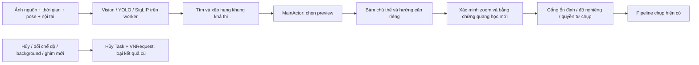

# Bố cục local theo toàn khung

## Luồng sử dụng

Bấm AI trong chế độ Photo. Ứng dụng phân tích một ảnh nguồn, tìm các bố cục khả thi và hiện tối đa ba ảnh xem trước. Chạm một phương án để căn máy theo vòng hướng dẫn. Một phương án rõ ràng, đủ tin cậy có thể được chọn tự động. Vùng có bằng chứng yếu chỉ hỗ trợ căn và chụp tay.

Phần này chạy trên thiết bị. Tùy chọn Gemini có sẵn vẫn là luồng cloud riêng, do người dùng bật. Không có dịch vụ mới, khóa API mới hoặc upload ảnh phục vụ học sở thích.

## Thuật toán thực tế

1. **Vision + YOLO:** người, khuôn mặt, thú cưng, vật thể, saliency và phân loại cảnh. Nếu model tùy chọn không tải được, các bộ nhận diện Vision còn hoạt động vẫn cung cấp bằng chứng.
2. **SigLIP Base có sẵn:** so sánh ngữ nghĩa toàn ảnh với 16 prompt, bổ sung hoa, lá, cận cảnh, bầu trời, mặt nước, hoàng hôn và đường phố. Encoder giữ nguyên trọng số. Prompt embedding được tạo khi build; không phải huấn luyện model.
3. **Tìm bố cục bằng hình học camera:** thử vị trí chủ thể và mức zoom dựa trên nội tại camera. Mọi góc của khung đề xuất phải nằm trong ảnh nguồn. Không phán đoán phần cảnh chưa nhìn thấy; không đề xuất zoom rộng hơn ảnh đang phân tích. Giữ đường viền chủ thể cùng các người/khuôn mặt đã phát hiện.
4. **Xếp hạng từ ảnh:** diện tích chủ thể theo ý đồ chụp, vùng chú ý được giữ lại, chi tiết gây phân tán ở mép, cân bằng khối thị giác, khoảng trống theo hướng đầu, tương phản sáng với vùng xung quanh và đối xứng sáng cho kiến trúc. Chi phí lia máy/zoom hạn chế thay đổi vô ích.
5. **So sánh tối đa sáu preview:** Core Image dựng preview từ các tia ảnh đã quan sát. SigLIP đánh giá sự phù hợp ngữ nghĩa của từng preview, đóng góp tối đa ±0,035. Giữ tối đa ba phương án khác biệt hình học cho giao diện. Đây là ảnh hướng dẫn; pipeline này không chỉnh byte RAW hay ảnh chụp gốc.
6. **Sở thích nhỏ trên máy:** actor lưu tối đa 500 lựa chọn giữa các khung. Đếm thắng/thua có smoothing, chỉ cộng điểm khi đủ lượt so sánh, ảnh hưởng tối đa ±0,025. Có xuất/xóa trong Settings. File chứa ý đồ, vị trí và kích thước tương đối; không chứa ảnh, GPS hay embedding khuôn mặt.

Các ý đồ gồm chân dung, người trong cảnh, nhóm người, phong cảnh, kiến trúc, hoa lá/cận cảnh, món ăn, thú cưng, vật thể và đường phố. Nhóm người có loại chủ thể riêng. Cảnh không có đối tượng nhận diện được chỉ dùng mốc chi tiết đo được từ ảnh; không tạo mốc giả trên vùng trơn.

## Trạng thái và luồng xử lý

Phân tích và render chạy trong `Task.detached`; dữ liệu sở thích nằm trong actor. `CameraViewModel` cập nhật UI trên MainActor. Cancellation token truyền đến từng VNRequest và vòng tìm kiếm. Mã thế hệ phiên cùng trạng thái hiện tại loại callback muộn. Hủy tác vụ không hứa ngắt ngay thao tác nạp model của hệ điều hành; kết quả của phiên bị hủy không được áp dụng.

Chọn khung kiểm tra lại zoom và tuổi ảnh nguồn (tối đa 30 giây). Không trộn điểm bố cục với độ tin cậy detector. Ghim mục tiêu giữ nguyên quyết định chỉ chụp tay. Cảnh rộng, kiến trúc và người trong cảnh còn cần độ nghiêng máy trong 3° trước tự chụp; đây là mức cân máy từ cảm biến, không phải phép tìm đường chân trời bằng ảnh.

## Kiểm thử

Workflow `.github/workflows/ios-build.yml` biên dịch và chạy `tests/CompositionPlanningRegression.swift` trên macOS bằng chính các file production, sau đó build iOS Release với warnings-as-errors.

Các ca Swift kiểm tra vùng ảnh quan sát được, phép chiếu anchor, bảo vệ người đi cùng, phân biệt ảnh nhóm, giữ bối cảnh, mốc cảnh thật, đường viền hoa/vật thể, ảnh hưởng của nền, NaN/cancellation, zoom hiện tại trên 5×, độ tin cậy dự phòng, chiều preview/raster và hủy VNRequest. Các bài Python cũ tiếp tục kiểm tra tham chiếu tracking, hợp đồng source và RAW; chúng không thay thế build Swift hoặc thử camera thật.

## Giới hạn được giữ rõ

- Điểm là phép so sánh heuristic, không phải xác suất ảnh đẹp, và SigLIP không phải model chấm thẩm mỹ đã được huấn luyện cho dự án.
- Không có fine-tune, mô hình sinh ảnh, học từ ảnh người dùng hoặc tuyên bố đã triển khai CROP.
- Chưa có thuật toán đường dẫn thị giác/horizon chuyên dụng, kiểm tra chớp mắt hay chấm khoảnh khắc quyết định mới trong thay đổi này.
- Tia ảnh giả định quay máy quanh tâm camera; tịnh tiến, parallax, chuyển ống kính và chuyển động chủ thể vẫn cần tracking/xác minh từ khung mới và thử nghiệm trên iPhone thật.
- Build và kiểm thử tổng hợp không chứng minh 60/120 FPS, chất lượng nhiếp ảnh hay hết mọi race condition trên phần cứng.
